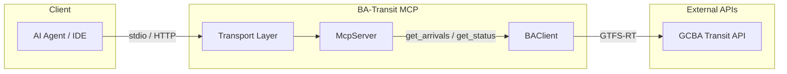

# Specification: BA-Transit MCP (v3.0)

## 1. Project Overview

The **BA-Transit MCP** is a standardized Model Context Protocol server that provides real-time public transit information for the Buenos Aires Metropolitan Area (AMBA). It focuses on the **Subte (Metro)** and **Train** systems, enabling AI agents to provide users with accurate arrival times and service status updates.

## 2. Technical Stack

| Category | Tool / Technology |
| --- | --- |
| **Runtime** | **Bun** (for performance, native TS support, and fast I/O). |
| **Transport** | **Streamable HTTP** (Modern stateless standard for remote/local usage). |
| **Linter/Formatter** | **Oxlint** (using its high-performance linting and available formatting features). |
| **Testing** | **Vitest** (for fast unit testing). |
| **CI/CD** | **GitHub Actions** (Automated build, lint, and test pipeline). |

---

## 3. Functional Requirements

1. **Arrival Queries:** The agent must be able to search for the next departures/arrivals at a specific station, including the direction of travel (e.g., *"Next train at Retiro towards Tigre"*).
2. **Dual Access:**
    - **Local:** Can be launched as a process with `stdio` for local IDEs.
    - **Remote:** Accessible via a stateless HTTP endpoint using Streamable HTTP.
3. **Transit Coverage:** Subte (Lines A, B, C, D, E, H, Premetro) and Trains (Mitre, Sarmiento, Roca, San Martín, Belgrano Sur, Belgrano Norte).

---

## 4. Non-Functional Requirements

### 4.1 Development Standards

- **Language:** TypeScript (strict mode).
- **Linting & Formatting:** All code must pass `oxlint` checks. Formatting will be handled by Oxlint's integrated formatting features to minimize dependencies.
- **Testing:** Unit tests for all data parsers and MCP tool handlers using **Vitest**.

### 4.2 Deployment & Runtime

- **Statelessness:** The remote server must not store session data, facilitating deployment on Cloudflare Workers, Railway, or DigitalOcean.
- **Transport Protocol:** Implementation must follow the latest MCP SDK spec for **Streamable HTTP**, providing a single POST endpoint for bidirectional message streaming.

### 4.3 Continuous Integration

The project will include a `.github/workflows/ci.yml` file to automate quality control.

- **Trigger:** On every `push` and `pull_request` to the main branch.
- **Tasks:**
    1. **Setup:** Install Bun environment.
    2. **Compile:** Run `bunx tsc --noEmit` to ensure type safety.
    3. **Lint:** Execute `oxlint` to verify code quality and formatting.
    4. **Test:** Run the full `vitest` suite.

---

## 5. API Research Findings

Based on the investigation, the BA-Transit MCP will interface with the following:

- **Primary Source:** **GCBA Unified Transit API** (`api-transporte.buenosaires.gob.ar`).
    - Provides GTFS-RT (Realtime) feeds for both Subte and Trains.
    - Requires a `client_id` and `client_secret` (obtainable via the GCBA Data Portal).

- **Alternative (Trains):** The "Trenes en Vivo" system provides granular data on train positions that can be mapped to station ETAs if the GTFS feed has high latency.

---

## 6. Architecture Diagram

---

## 7. Implementation Roadmap

### Phase 1: Environment Setup
- Initialize with `bun init`.
- Configure `oxlint` and `vitest`.
- Create the GitHub Action workflow for CI.

### Phase 2: Client Development
- Implement the `BAClient` to handle GCBA API authentication and fetch GTFS-RT data.

### Phase 3: MCP Server Core
- Define the Tools (`get_arrivals`, `get_status`) using the MCP SDK.
- Set up the `McpServer` instance.

### Phase 4: Multi-Transport Entrypoint
- Create a conditional logic to start either a `StdioServerTransport` or a Hono-based **Streamable HTTP** handler.

---

## 8. MCP Tools Reference

### `get_arrivals`

Query next departures/arrivals at a specific station.

**Parameters:**
| Name | Type | Required | Description |
|------|------|----------|-------------|
| `station` | string | Yes | Station name or ID |
| `line` | string | No | Specific line (e.g., "A", "Mitre") |
| `direction` | string | No | Direction of travel |
| `limit` | number | No | Maximum results (default: 5) |

**Returns:** Array of upcoming arrivals with estimated times.

### `get_status`

Get current service status for transit lines.

**Parameters:**
| Name | Type | Required | Description |
|------|------|----------|-------------|
| `line` | string | No | Specific line to check |
| `type` | string | No | "subte" or "train" |

**Returns:** Service status including delays, alerts, and operational state.

---

## 9. Environment Variables

| Variable | Required | Description |
|----------|----------|-------------|
| `BA_CLIENT_ID` | Yes | GCBA API client ID |
| `BA_CLIENT_SECRET` | Yes | GCBA API client secret |
| `TRANSPORT` | No | "stdio" or "http" (default: "stdio") |
| `PORT` | No | HTTP server port (default: 3000) |
